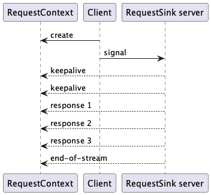
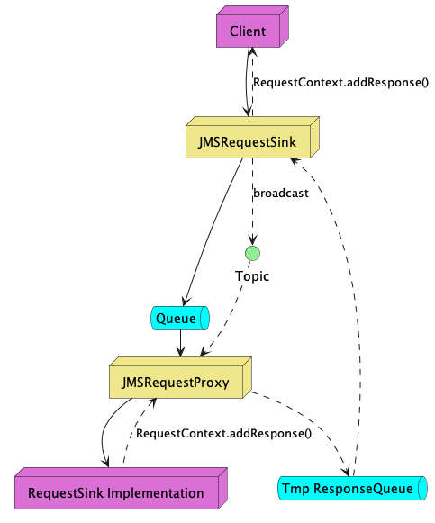
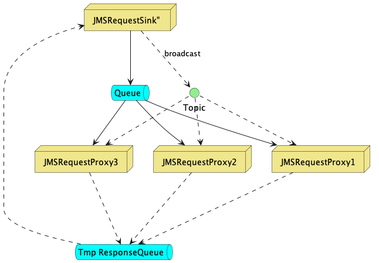

# RequestSink

The RequestSink mechanism is a message-based asynchronous request-response mechanism.
The mechanism has an implementation agnostic interface, but the only implementation
in this library is using JMS.

## Concepts

A **[RequestSink](../requestsink/src/main/java/no/mnemonic/messaging/requestsink/RequestSink.java)**
is a sink to send a request 
**[Message](../requestsink/src/main/java/no/mnemonic/messaging/requestsink/Message.java)** 
to, which can be a message channel (seen from the client), 
or can be the implementing
server which receives the asynchronous signal.

The format of the message is up to the client and sink to agree on, 
but each message has a **callID**, a **timestamp**, a **priority** 
and a **response window size**.

Along with the signal, the client sends a
**[RequestContext](../requestsink/src/main/java/no/mnemonic/messaging/requestsink/RequestContext.java)**
which the server will send responses to.
The RequestSink also contains a method for signalling **keepalive** (to avoid)
timeouts, an **end-of-stream** method to signal that the last response has been
received, and methods to notify the client about errors or unexpected closure of the request.
It also lets the server check if the client is still willing to receive responses.

The client will inform the server about the how long it will wait
for an answer using a "RequestTimeout" property.
While processing, the server should regularly invoke *keep-alive* to keep the client
informed that the request is still being processed, extending the timeout. 

The server can submit any number of responses back to the client, 
allowing the server to *stream* a large response back in smaller parts.

## JMS Request Sink

The JMS RequestSink implementation uses JMS to carry requests from 
the client side to the server side.
The **[JMSRequestSink](../requestsink-jms/src/main/java/no/mnemonic/messaging/requestsink/jms/JMSRequestSink.java)** 
implements the client-side of the sink, while the  
**[JMSRequestProxy](../requestsink-jms/src/main/java/no/mnemonic/messaging/requestsink/jms/JMSRequestProxy.java)**
listens to messages on the server-side, and proxies them to a
RequestSink server implementation which actually responds to the message.

The JMSRequestProxy listens to a well-defined JMS Queue,
allowing multiple proxies to load-balance incoming messages between them.

The JMSRequestSink creates a temporary response-Queue to
receive responses (which is reused across multiple requests).
The request message from the sink to the server contains
a "replyTo" field pointing back to the response queue,
and a "callID" (in the JMS correlation ID field) which is used to
correlated responses to the request.

### Broadcasting topic 

The JMSRequestProxy listens to a broadcast Topic, used to receive acknowledgements
and abort signals from the client side. 

Starting from version 1.4.5, the JMSRequestProxy subscribes the topic selecting
messages *without* a ServerNodeID, or where the ServerNodeID *matches the
ServerNodeID of the JMSRequestProxy*. (Clients are notified of the ServerNodeID
of the JMSRequestProxy in the response messages).

This allows clients to send an *abort* or *acknowledge* on the broadcast topic, 
while still targeting a single JMSRequestProxy.

### Scalability

The RequestSink mechanism is designed to scale seamlessly with 
growing number of clients and servers.

All servers (JMSRequestProxy) listen to the same queue, and will
thereby automatically share the load evenly across the consumers.
Adding more server capacity is done by adding additional consumers.

As all clients connect to the same Queue, the clients do not control which 
server node is responding to a request.

The temporary response queue is created by the JMSRequestSink, so there is
one response queue per client. The response queue may be replaced if the client
suspects timeout, or if the connection to the JMS broker is interrupted.

### Protocol versions

The JMS RequestSink implementation has evolved over time, currently supported versions are
* V4 (default)
* V5 includes flow control

JMSRequestProxy servers will always be compatible with all supported versions, 
and the client decides the protocol version in the request.

Servers must always be upgraded before clients are configured to start using 
an upgraded protocol version.

### Flow control

Flow control was added to protocol V5, to avoid overrunning the client with
too many responses, which could exhaust memory on the client.

The client will broadcast an acknowledgement message back to the
server on the *broadcast topic*, marked with the ServerNodeID and CallID,
to acknowledge when the client has consumed a message, 
allowing the server to send more responses.

Inspired by the TCP sliding window mechanism, the client defines a "response window" 
to allow the server to send multiple responses, where every added 
response reduces the server window, 
while received acknowledgements increases the window, 
thereby keeping a limited number of response messages "en route".

